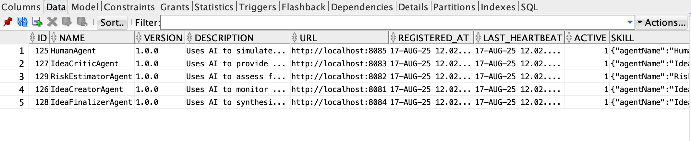

# Idea creator

Minimal multi-module setup for the Idea of an intangible product.

## Modules
- `shared-config` – shared config
- `idea-creator-agent` – seeds ideas
- `risk-estimator-agent` - risk estimates
- `dea-critic-agent` – idea critic
- `idea-finalizer-agent` – idea finalizer
- `human-agent` – simple replacment for Human in the loop :)
- `orchestration-service` – workflow for all the activity, use receptionist concept


## Quick start
1. Install locally the A2A protocol (with receptionist module) from my repository - https://github.com/kkaduk/a2a-java-ext 

It is forked from https://github.com/a2aproject/a2a-java project and added the receptionist module (receptionist depend only on the spec module)

mvn clean install (in a2a-java-ext catalog)

You need a database to persist registered agents (in my case, an Oracle database with table A2A_AGENTS).




You must export shell variables (examples)

- DEMO_PWD=passwd
- TNS_ADMIN=/Project/oracle/poc/dbwallet.  (Oracle database wallet location if used)
- OPENAI_API_KEY=XXXXXXX

Or other if needed


2. Compile the agents - in dea-agents catalg (require to compile the shared-config!)

./build-all.sh (need to install shared config)

2. Run all agents and orchestrator

./start-all.sh


3. Seed an idea:
   ```bash
   curl -X POST "http://localhost:6060/api/banking/products/develop" \
     -H "Content-Type: text/plain" \
     -d "Development of a proposition, an idea for a bank product based on recent legislation and the European Commission's Climate Action initiative."
   ```

You should see example report:

4. Stop microservices

./stop-all.sh


5. A2A table

CREATE TABLE "DEMO"."A2A_AGENTS" 
   ("ID" NUMBER NOT NULL, 
	"NAME" VARCHAR2(255 BYTE) COLLATE "USING_NLS_COMP" NOT NULL ENABLE, 
	"VERSION" VARCHAR2(255 BYTE) COLLATE "USING_NLS_COMP" NOT NULL ENABLE, 
	"DESCRIPTION" VARCHAR2(1000 BYTE) COLLATE "USING_NLS_COMP", 
	"URL" VARCHAR2(255 BYTE) COLLATE "USING_NLS_COMP" NOT NULL ENABLE, 
	"REGISTERED_AT" TIMESTAMP (6), 
	"LAST_HEARTBEAT" TIMESTAMP (6), 
	"ACTIVE" NUMBER(1,0) DEFAULT 1 NOT NULL ENABLE, 
	"SKILL" CLOB COLLATE "USING_NLS_COMP", 
	 PRIMARY KEY ("ID"));

5. It is a work-in-progress demo for testing A2A receptionist concepts.

I am working on:

- Agent skills discovery based on the orchestrator user's prompt
- Plan preparation (for invoking other agents' suitable skills)
- Plan execution (based on the prepared LLM JSON tasks acyclic graph)
- Invocation of the agent's skills (using the receptionist library)
- Results synthesis and output elaboration (LLM).


All is in the early stages of development.

In the final version:

- Adding for every agent the MCP server connection for context and actions (already done based on Spring-ai in another project)