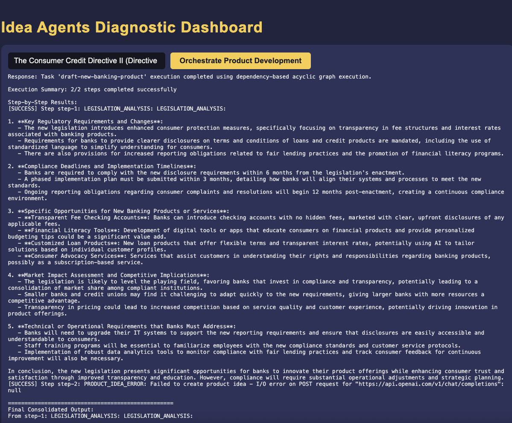
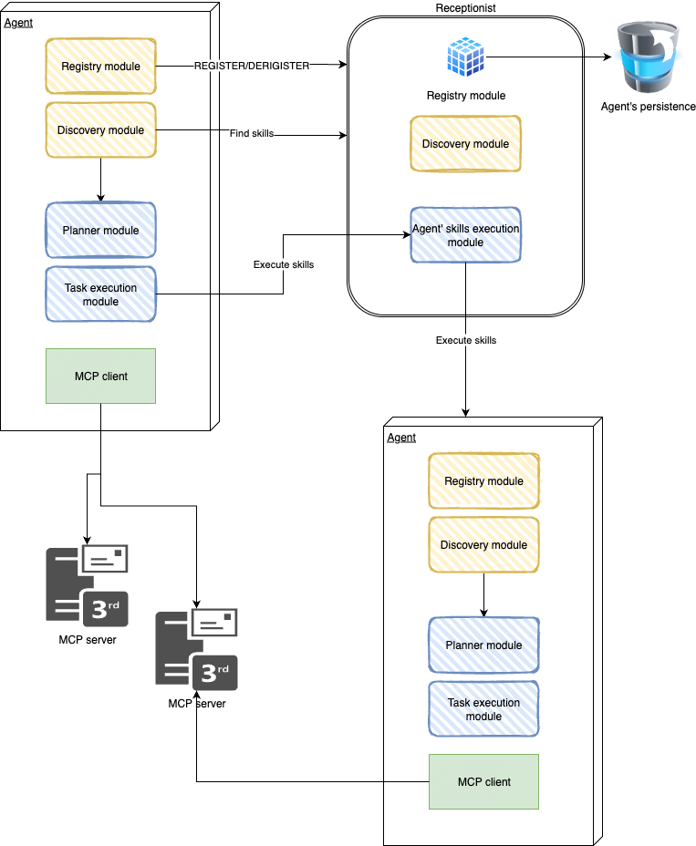

## Multi-Agent Strategy Update

### Overview  
The latest commit introduces an update to the **multi-agent strategy**.  
This enhancement focuses on **task distribution**, where tasks are now planned and executed through a agent's created task plan.  

### Current Status  
Please note that this implementation is **experimental** and not yet representative of what will be deployed in an enterprise-grade solution.  

Several challenges remain open, including:  
- Designing a robust **memory strategy**  
- Establishing a rigorous **implementation logic**  
- Ensuring long-term **scalability and reliability**  

### Roadmap & Outlook  
While the concept of **evolved autonomous agents** represents a promising future for business workflows,  
the current implementation should be viewed as a **demo** environment.  

Its purpose is to provide a space to **experiment** with autonomous task planning and execution,  
while we continue to build toward a production-ready solution through incremental, step-by-step improvements.  


## Current Work: Reusable Agents and MCP Integration

### Overview  
The current development effort is focused on preparing **reusable agents** designed for proper connection to **MCP servers**, with the goal of providing a **practical, production-ready solution**.  

### Objectives  
- Establish a solid foundation for building a **multi-agent system**.  
- Ensure that each **single agent** is effective on its own.  
- Validate that agents **interact appropriately with their environment** before scaling to multi-agent collaboration.  

### Next Steps  
The priority is to finalize the implementation of a **robust single agent**.  
Once this is achieved, the architecture can evolve into a **fully integrated multi-agent system** supported by MCP connectivity.  


# Idea creator

Minimal multi-module setup for the Idea of an intangible product.

## Modules
- `shared-config` – shared config
- `idea-creator-agent` – seeds ideas
- `risk-estimator-agent` - risk estimates
- `idea-critic-agent` – idea critic
- `idea-finalizer-agent` – idea finalizer
- `human-agent` – simple replacment for Human in the loop :)
- `orchestration-service` – workflow for all the activity, use receptionist concept


## Quick start
1. Install locally the A2A protocol (with receptionist module) from my repository - https://github.com/kkaduk/a2a-java-ext 

It is forked from https://github.com/a2aproject/a2a-java project and added the receptionist module (receptionist depend only on the spec module)

`mvn clean install` (in a2a-java-ext catalog)

You need a database to persist registered agents (in my case, an Oracle database with table A2A_AGENTS).


You must export shell variables (examples)

- DEMO_PWD=passwd
- TNS_ADMIN=/Project/oracle/poc/dbwallet.  (Oracle database wallet location if used)
- OPENAI_API_KEY=XXXXXXX

Or other if needed


2. Build the agents - in `idea-agents` catalg run:

`./build-all.sh` (need to install shared config)

2. Run all agents and orchestrator

`./start-all.sh`


3. Seed an idea:
4. 


You could see example log of all other agent in UI.

4. Stop microservices

./stop-all.sh


5. A2A table

```sql
CREATE TABLE "DEMO"."A2A_AGENTS" 
   ("ID" NUMBER NOT NULL, 
	"NAME" VARCHAR2(255 BYTE) COLLATE "USING_NLS_COMP" NOT NULL ENABLE, 
	"VERSION" VARCHAR2(255 BYTE) COLLATE "USING_NLS_COMP" NOT NULL ENABLE, 
	"DESCRIPTION" VARCHAR2(1000 BYTE) COLLATE "USING_NLS_COMP", 
	"URL" VARCHAR2(255 BYTE) COLLATE "USING_NLS_COMP" NOT NULL ENABLE, 
	"REGISTERED_AT" TIMESTAMP (6), 
	"LAST_HEARTBEAT" TIMESTAMP (6), 
	"ACTIVE" NUMBER(1,0) DEFAULT 1 NOT NULL ENABLE, 
	"SKILL" CLOB COLLATE "USING_NLS_COMP", 
	 PRIMARY KEY ("ID"));
```


1. It is a work-in-progress demo for testing A2A receptionist concepts.

I am working on:

- Agent skills discovery based on the orchestrator user's prompt
- Plan preparation (for invoking other agents' suitable skills)
- Plan execution (based on the prepared LLM JSON tasks acyclic graph)
- Invocation of the agent's skills (using the receptionist library)
- Results synthesis and output elaboration (LLM).


All is in the early stages of development.

In the final version:

- Adding for every agent the MCP server connection for context and actions (already done based on Spring-ai in another project)


# Multiagent architecture

# Multi-Agent Environment Architecture

The presented architecture describes a **collaborative multi-agent system** designed to support dynamic task execution, integration with external systems, and flexible workflow orchestration. Agents operate as **autonomous and specialized entities** that can either provide specific skills (workers) or coordinate higher-level activities (organizers).

From a business perspective, this environment enables **scalable automation**, **knowledge sharing**, and **seamless human–machine collaboration**, while maintaining governance and persistence through a centralized Receptionist service.

---



## Core Components

### 1. Agent
Each agent is an **independent, skill-based unit** that can both consume and provide capabilities within the ecosystem.  
Agents register themselves at startup and deregister when finalized, ensuring that the environment always maintains an up-to-date view of available skills.

An agent consists of the following modules:

- **Registry Module**  
  Manages the lifecycle of agent registration and deregistration with the Receptionist.

- **Discovery Module**  
  Responsible for locating and retrieving the skills of other agents by querying the Receptionist.

- **Planner Module**  
  After collecting skills from the Receptionist (via A2A cards), the agent evaluates and selects the most suitable skills for a given business task.  
  The planner allows for **dynamic task orchestration**, where workflows can be sequential, parallel, or mixed.

- **Task Execution Module**  
  Executes the selected skills by sending A2A protocol requests to peer agents and aggregating their responses.  
  The task execution logic is capable of handling **acyclic graph**, enabling flexible and reusable orchestration patterns.

- **MCP Client**  
  Integrates the agent with the **Model Context Protocol (MCP) servers** and external tools.  
  This module provides access to the **outside world** for data collection, service invocation, or action execution—bridging internal orchestration with external enterprise systems.

---

### 2. Receptionist
The **Receptionist** acts as a **governance and coordination layer** for the entire agent ecosystem.  
It extends the A2A protocol with additional services to ensure **skill discovery, persistence, and controlled execution**.

Key responsibilities include:

- **Agent Registration & Deregistration**  
  Accepts new agent registrations along with their declared skills.  
  Updates the system registry dynamically as agents join or leave the environment.

- **Persistence**  
  Maintains a **centralized record** of agents and their skills in a persistent database.  
  This enables reliable discovery, auditing, and long-term governance of available capabilities.

- **Skill Execution Proxy**  
  Executes agent skills when invoked via A2A protocol requests.  
  This mechanism ensures consistent access to distributed skills across the ecosystem.

---

## Process Walkthrough

This section illustrates how a **business task** flows through the multi-agent environment:

1. **Agent Startup**  
   - An agent initializes and **registers its skills** with the Receptionist.  
   - The Receptionist stores this information in the persistence layer for future discovery.

2. **Skill Discovery**  
   - Another agent requires a capability to perform its assigned task.  
   - It queries the **Receptionist’s Discovery Module** to identify which agents provide the required skill.

3. **Planning the Workflow**  
   - The requesting agent’s **Planner Module** evaluates the available skills and selects the most suitable agent(s).  
   - It constructs a **workflow graph** (sequential, parallel, or hybrid) to complete the task efficiently.

4. **Task Execution**  
   - The requesting agent uses its **Task Execution Module** to send A2A protocol requests to the selected agents.  
   - Responses are collected and aggregated into a unified result.

5. **External Integration**  
   - If the workflow requires interaction with external systems (e.g., databases, ERP, APIs, IoT), the **MCP Client** connects to MCP servers and invokes the necessary external tools.

6. **Result Delivery**  
   - The workflow completes and returns results to the initiating agent.  
   - If the initiating agent is a “human-facing” organizer, the result may be delivered directly to a human user in natural language or structured business format.

This step-by-step flow ensures **task transparency, accountability, and flexibility**, while maintaining **enterprise-grade governance and reliability**.

---

## Business Value

This architecture creates a **scalable and modular automation environment** with several business advantages:

- **Flexibility and Specialization**  
  Agents can be tailored to specific roles—some optimized for execution (workers), others for orchestration and human interaction (organizers).

- **Human–Agent Symmetry**  
  Humans are treated as equal workflow participants, allowing for seamless collaboration between people and digital agents within the same process.

- **Workflow Agility**  
  The acyclic task execution graph enables **parallel, sequential, or hybrid workflows**, supporting both routine automation and complex business processes.

- **Integration with Enterprise Systems**  
  Through the MCP client and servers, agents can securely connect to **external enterprise systems, APIs, and data sources** without exposing sensitive workflows to uncontrolled environments.

- **Governance & Reliability**  
  The Receptionist ensures **controlled skill discovery, auditability, and persistence**, reducing operational risk and ensuring enterprise-grade compliance.

---

## Example Use Cases

- **Enterprise Process Automation**  
  Automating approval flows, reporting chains, and document processing across distributed teams.

- **Knowledge-Driven Workflows**  
  Discovering specialized skills (e.g., financial analysis, legal document parsing) and composing them dynamically into workflows.

- **Hybrid Human–Machine Collaboration**  
  Allowing employees and agents to cooperate in a shared orchestration model, where humans delegate tasks and agents execute them.

- **External System Orchestration**  
  Integrating data and actions from external systems (databases, ERP, IoT, APIs) through MCP-enabled clients.

---

✅ This architecture establishes the foundation for **enterprise-ready multi-agent systems**—offering governance, specialization, integration, and collaboration in a unified, extensible model.
